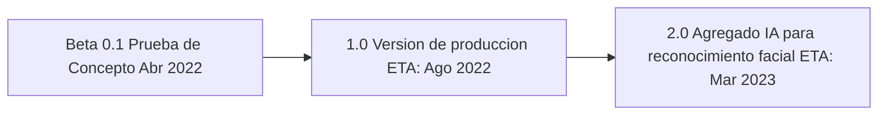

# Socialnet Panic Button
 "Protege tus redes sociales, facilmente" 

Socialnet Panic Button (SPB) es una app facil de usar para situaciones de emergencia. 
Si perdes o te roban tu telefono celular, o simplemente notas que estas siendo hackeado, SPB te permite, **con solo apretar un boton**, cambiar todas las contraseñas de tus redes sociales al mismo tiempo, asegurando que nadie pueda acceder a tus redes en cuestion de segundos.

## Informacion de compilacion

Version: 0.1 Beta, released April 3 2022, ITBA - Buenos Aires Argentina.

Github: https://github.com/igruntplay/hackitba.

Creators: Gaspar Onesto, Cristian Arean, Leandro Planas.

Equipo: Vodka Juniors - Modalidad Presencial.

## Redes Compatibles
Trabajamos constantemente para agregar nuevas redes a nuestra app, vea las redes compatibles segun la version

Prueba de Concepto, V0.1: 
 - Twitter
 - Discord

Produccion, V1.0 (ETA Julio 2022):
 - Twitter 
 - Instagram
 - Linkedin
 - Facebook
 - Discord

## Funcionamiento
<<<<<<< HEAD
SPB es una app facil de usar, inspirados en las "paradas de emergencia" de las maquinas, que automatiza la ardua tarea de bloquear las redes en caso de emergencia. Frente a la orden del usuario, cambiara todas las contraseñas de las redes sociales seleccionadas, solicitando la renovacion de la contraseña en las redes indicadas, y posterior al cambio, grabara internamente la nueva password.

Para configurar su usuario de SPB necesita lo siguiente:
- Nro de Documento de Identidad
- Email de cada red social (sea este, 1 correo para todas las redes o 1 correo por red)
- Acceso, a el/los emails declarados en el punto 1 (usuario y password)
- Configuracion de Huella digital con lector de huellas. 
- Fotografia tipo selfie (disponible en V2.0)

Una vez descargada la app, debera crear un usuario con su correo y una password de acceso, luego, le pedira ingresar su huella digital, si esto no estuviera disponible, le pedira tomarse una selfie (disponible en V2.0). 

SPB es una app facil de usar, inspirados en las "paradas de emergencia" de las maquinas, que automatiza la ardua tarea de bloquear las redes en caso de emergencia. Frente a la orden del usuario, cambiara todas las contraseñas de las redes sociales seleccionadas, solicitando la renovacion de la contraseña en las redes indicadas, y posterior al cambio, enviara la nueva password.

Para configurar su usuario de SPB necesita lo siguiente:
- Nro de Documento de Identidad
- Email de cada red social
- Acceso, a el/los emails declarados en el punto 1 (password)
- Configuracion de Huella digital con lector de huellas. 
- Fotografia tipo selfie (disponible en V2.0)

Una vez descargada la app, debera crear un usuario con su correo y una password de acceso, luego, le pedira ingresar su documento y huella digital, si esto no estuviera disponible, le pedira tomarse una selfie (disponible en V2.0). 

Configurada la app, simplemente tendra disponible el boton de panico, al activarlo se ejecuta el funcionamiento, reiniciando todas las claves solicitadas. Para editar las opciones debera presionar los 3 puntos, en el borde superior de la pantalla. 

En caso, que no disponga de su celular, puede descargarla en cualquier telefono, logearse con docuemento, huella digital o si no estuviera disponible un sensor de huellas, reconocimiento por IA (disponible en V2.0). Ingresado en la APP podra ejecutar el Panic Button. 

Luego, con mayor tranquilidad y lejos del peligro podra acceder a esta app, obtener las nuevas claves, y renovar sus contraseñas por las de su preferencia. SPB no accede a sus redes sociales. 

# Detalles tecnicos

SPB corre en un servidor, bajo python, con un web scrapper (selenium) activando la funcionalidad de renovacion de contraseña, una vez clikeada la funcion, escucha el correo electronico de la app y extrae el link de recuperacion, generando una nueva contraseña aleatoria de 8 digitos que guarda en en su poder. 

Dado que el concepto de SPB es una situacion de emergencia, como ser robo en la via publica, o sustraccion o perdida, SPB permite descargar en cualquier telefono la app, logearse usando documento (algo que se) y la tecnologia de lectura de huellas digitales (algo que soy) o reconocimiento por IA(algo que soy. disponible en V2.0) si no estuviera la huella disponible, y le permitira inmediatamente ejecutar el boton de panico, quien renovara todas las contraseñas.  

Buscamos evitar los captcha usando delays en el codigo, pero si detectamos un Captcha usamos la api de https://anti-captcha.com/ que esta resueltos por humanos. En caso de 2FA como google authenticator, debemos usar los codigos de backup para poder acceder al correo y escuchar nuestro email de recuperacion. 

# Roadmap

SBP tiene previstos los siguientes upgrades

# Palabras finales 
Esta app fue pensada para ayudar a personas con dificultades con la tecnologia, quienes muchas veces ven sus redes vulneradas al sufrir perdida o robo de sus telefonos celulares por no poseer los conocimientos para asegurar sus redes repidamente. Hemos diseñado y codeado esta app con amor pensando en nuestro padres como potenciales usuarios de la misma. Toda sugerencia, es bien recibida. 

# Diagrama de arquitectura en la nube

